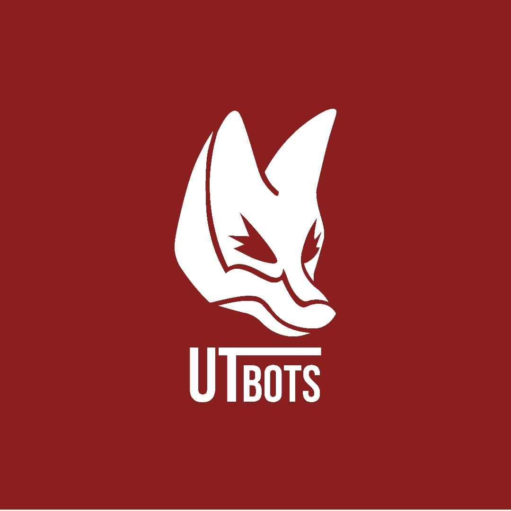

# 🟡 UTBots grSim - Simulador RoboCup SSL-EL

Este repositório contém uma versão **modificada do grSim**, o simulador oficial da [RoboCup Small Size League (SSL)](https://ssl.robocup.org/), adaptada para uso na categoria **SSL Entry Level** pela equipe **UTBots** 🦊.

<div align="center">
  
</div>

---

## 🔧 O que foi modificado nesta versão?

- O simulador **inicia automaticamente com os padrões oficiais da SSL-EL**
- Preparado para integração com o ambiente de simulação da equipe (grSim + Game Controller + Software de Estratégia)
- Pode ser usado com a nossa estratégia

---

## 📦 Requisitos do sistema

> Para rodar o grSim com bom desempenho:

- CPU Dual Core (2.0 GHz+)
- 1GB de RAM
- GPU com 256MB (preferencialmente NVIDIA ou AMD)

---

## 🖥️ Dependências de software

Este simulador foi testado em distribuições Linux (Ubuntu e derivados). As dependências são as mesmas do grSim convencional:

- `CMake` (>= 3.5)
- `pkg-config`
- `Qt5` (bibliotecas de desenvolvimento)
- `OpenGL`
- `ODE` (Open Dynamics Engine)
- `VarTypes` (já incluso no projeto)
- `Protobuf`
- `Boost` (usado pelo VarTypes)

> Consulte o arquivo [INSTALL.md](INSTALL.md) original para instruções detalhadas de instalação.

---

## 🚀 Como compilar

```bash
git clone https://github.com/UTBots/grSim.git
cd grSim
mkdir build
cd build
cmake ..
make -j$(nproc)